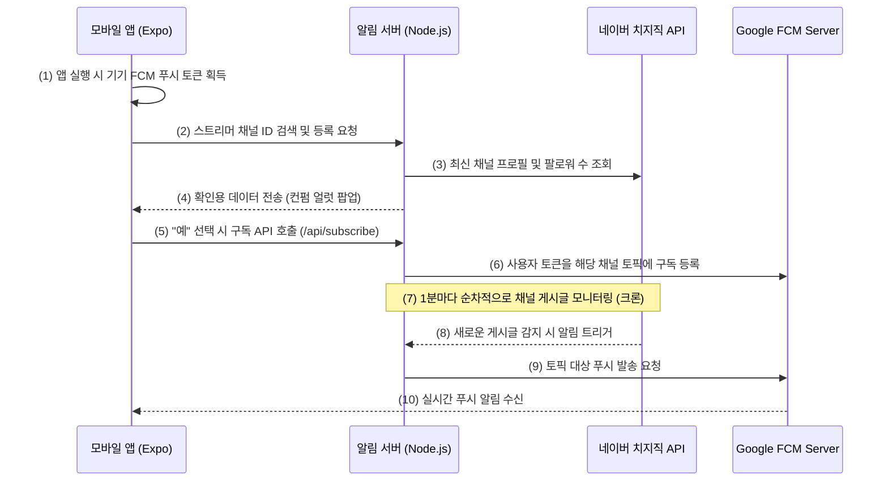

# 📱 치지직 스트리머 커뮤니티 알림 앱 (Chzzk Streamer Notification App)

치지직(CHZZK) 스트리머의 커뮤니티 게시글 등록을 실시간으로 감지하여 모바일 기기로 즉각 푸시 알림을 전송해 주는 Android용 하이브리드 애플리케이션입니다.

 

---

## 🚀 주요 기능 (Key Features)

1. **실시간 커뮤니티 알림 (FCM Push)**
   * 스트리머가 커뮤니티 게시판에 새로운 글을 작성하거나 공지를 올릴 시, 1분 이내에 기기로 FCM(Firebase Cloud Messaging) 푸시 알림이 발송됩니다.
   * 알림을 클릭하면 치지직 공식 웹/앱의 해당 게시글 상세 페이지(`https://chzzk.naver.com/{channelId}/community/detail/{postId}`)로 다이렉트 이동합니다.

2. **직관적인 스트리머 등록 프로세스 (Validation)**
   * 치지직 스트리머의 고유 채널 ID(32자리 16진수)를 입력하여 추가합니다.
   * 추가 시 네이버 API와 실시간 동기화하여 **스트리머의 닉네임, 프로필 이미지, 팔로워 수**를 띄워 본인이 추가하려는 스트리머가 맞는지 컨펌("예/아니오") 단계를 거칩니다.

3. **로컬 알림 히스토리 관리**
   * 지금까지 수신된 알림 내역들이 앱 내부 저장소(AsyncStorage)에 날짜 순서대로 기록됩니다.
   * 필요에 따라 알림 목록을 개별 삭제하거나 전체 삭제(일괄 비우기)하여 관리할 수 있습니다.

4. **다이내믹 시스템 테마 대응**
   * 사용자의 모바일 기기 설정(라이트 모드 / 다크 모드)에 맞추어 UI 테마 컬러가 유연하고 아름답게 자동 변환됩니다.

---

## 🛠️ 기술 스택 (Tech Stack)

* **프레임워크**: React Native / Expo (TypeScript)
* **상태/데이터 관리**: React Hooks, AsyncStorage (로컬 영속성 보존)
* **알림 엔진**: `expo-notifications`, Firebase Cloud Messaging (FCM)
* **네트워크 통신**: `axios` (HTTP API 호출)
* **스타일링**: React Native StyleSheet (시스템 테마 대응 다이내믹 컬러 구조)

---

## 🔄 시스템 작동 흐름 (Workflow)

---

## 📦 APK 설치 및 사용 방법

1. **다운로드**:
   * 본 깃허브 저장소의 **Releases** 탭에서 가장 최신 버전의 `app-release.apk` 파일을 모바일 기기로 다운로드합니다.
2. **설치**:
   * 다운로드 완료 후 APK 파일을 실행합니다. (출처를 알 수 없는 앱 설치 권한 허용 필요)
3. **알림 수신동의**:
   * 앱 실행 시 요청되는 알림 권한을 반드시 **"허용"**해 주셔야 실시간 푸시 알림이 발송됩니다.
4. **스트리머 등록**:
   * 알림을 받고 싶은 스트리머의 32자리 채널 ID를 등록하고 알림 서비스를 즐겨보세요! (알림 서버는 `https://api.azestkingscrown.cloud`로 자동 연동되어 작동합니다.)
